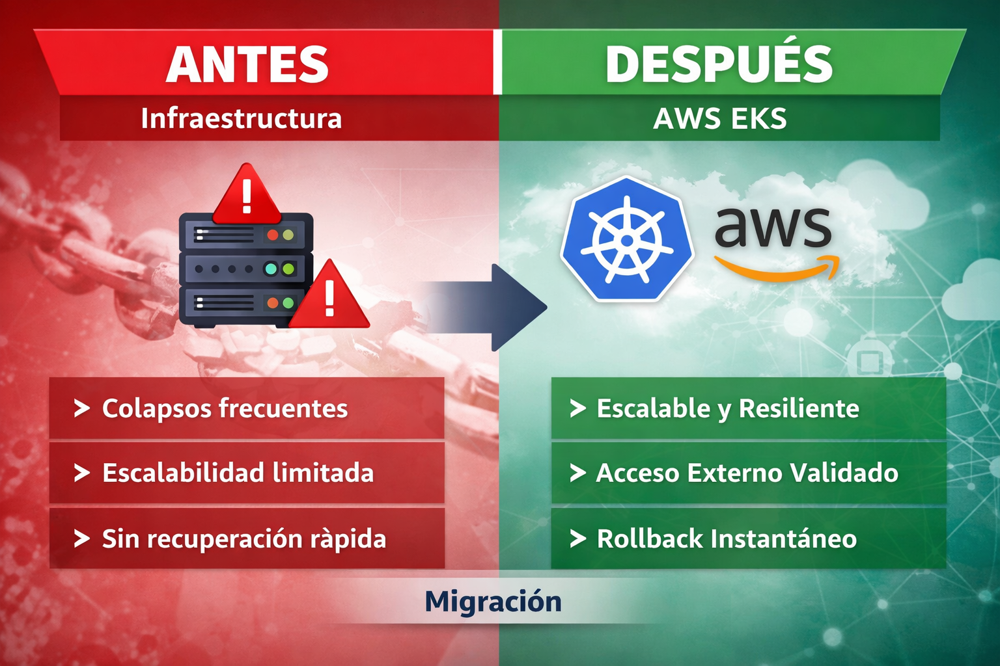
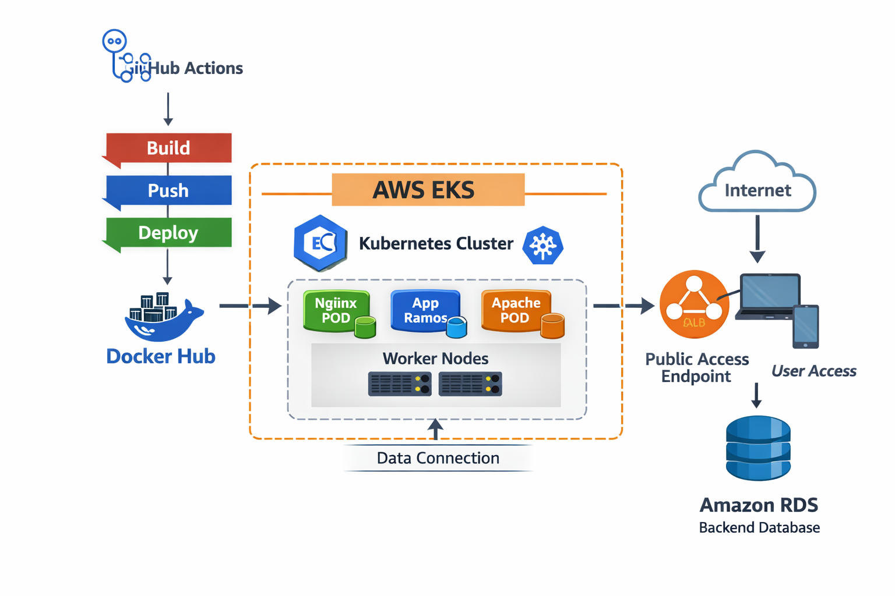
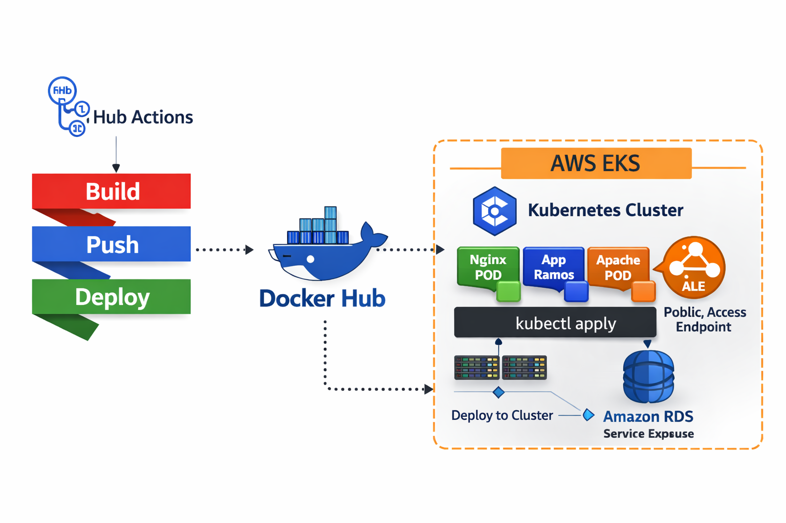
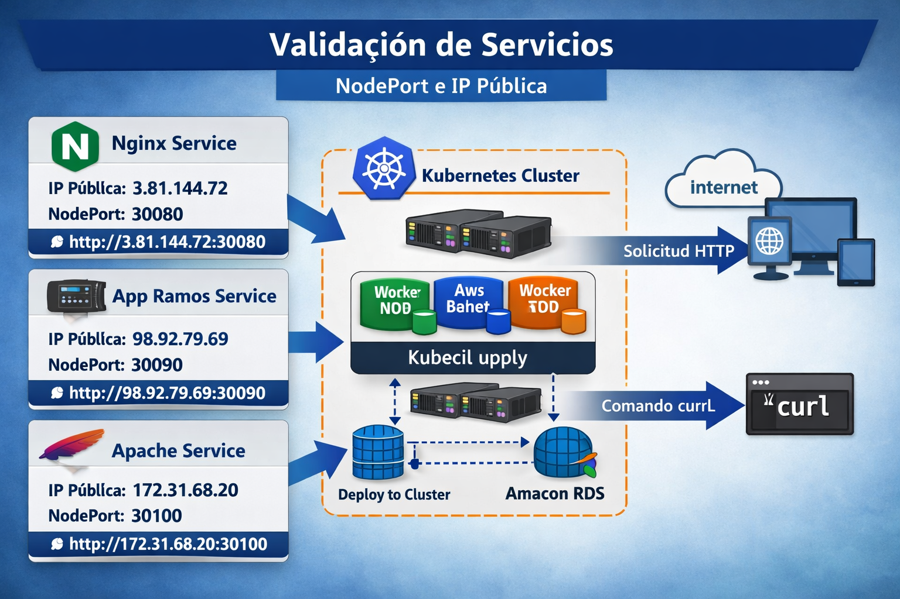
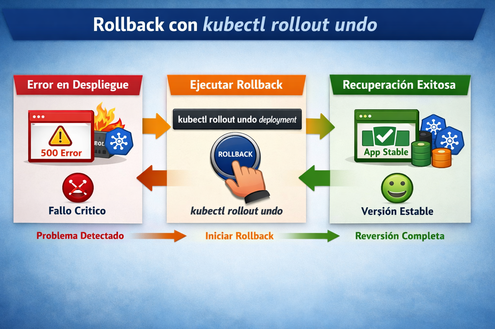
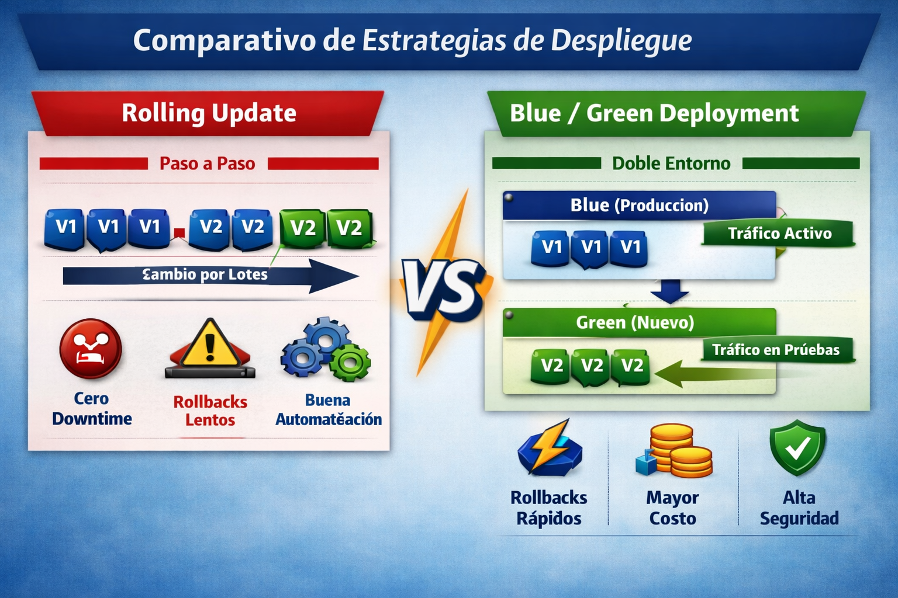

**# Informe Fase B — Proyecto de Laboratorio EKS**



**## 📌 Introducción**

**Este laboratorio demuestra la transformación de la infraestructura de TechMaster LTDA desde un entorno rígido y colapsado hacia un sistema escalable y resiliente en AWS EKS.**  

**Se documenta la configuración del cluster, despliegue de aplicaciones y validaciones de acceso.**


**---**


**## ⚙️ Configuración del Cluster**

**- \*\*Nombre del cluster\*\*: `cluster-sebastian-vargas`**

**- \*\*Versión de Kubernetes\*\*: `1.35`**

**- \*\*Roles IAM\*\*:**

&#x20; **- Cluster Role: `LabEksClusterRole-4YIce5MGvpts`**

&#x20; **- Node Role: `LabEksNodeRole-m3UN7RT3KF0J`**

**- \*\*VPC\*\*: `vpc-03d1e94351aa9cd70` (predeterminada)**

**- \*\*Subnets\*\*: públicas (`subnet-04e2671a2b698b73c`, `subnet-0f5e2c7fea8468846`, etc.)**


**---**




**## 🐳 Pipeline CI/CD**

**El flujo implementado en GitHub Actions realiza:**

**1. \*\*Build \& Push\*\* de imágenes Docker (`nginx`, `app-ramos`, `apache`) hacia Docker Hub.**

**2. \*\*Deploy\*\* en EKS usando `kubectl apply` sobre los manifiestos en `k8s/`.**


**---**



**## 🚀 Despliegue de Aplicaciones**

**- \*\*nginx-service\*\* → NodePort `30080`**

**- \*\*app-ramos-service\*\* → NodePort `30090`**

**- \*\*apache-service\*\* → NodePort `30100`**


**Los pods se encuentran en estado \*\*Running\*\* tras la aplicación de manifiestos.**


**---**


**## 🌐 Validación de Accesos**



**- \*\*IPs públicas de nodos\*\*:**  

&#x20; **- `3.81.144.72`**  

&#x20; **- `98.92.79.69`**


**- \*\*Acceso por navegador\*\*:**  

&#x20; **- `http://<IP\_PUBLICA>:30080` → Nginx**  

&#x20; **- `http://<IP\_PUBLICA>:30090` → App Ramos**  

&#x20; **- `http://<IP\_PUBLICA>:30100` → Apache**  


**- \*\*Acceso por curl\*\*:**

&#x20; **```bash**

&#x20; **curl http://3.81.144.72:30080**

&#x20; **curl http://3.81.144.72:30090/**

&#x20; **curl http://3.81.144.72:30100**


**🔄 Estrategias de Rollback**





**Se probó el comando:**


**kubectl set image deployment/app-ramos-deployment app-ramos=sebastianvargas/app-ramos:imagen-inexistente**

**kubectl rollout undo deployment/app-ramos-deployment**

**Antes: pods en estado ImagePullBackOff.**


**Después: rollback exitoso a la versión estable anterior.**


**Conclusiones**

**La infraestructura ahora es escalable y resiliente bajo demanda.**


**Se validó el acceso externo a los servicios vía NodePort.**


**Se demostró la capacidad de rollback ante errores de despliegue.**


**Evidencias (pantallazos y logs) respaldan la narrativa de transformación:**


**Antes: colapsos y mala reputación.**


**Después: estabilidad, accesibilidad y recuperación rápida.**


**Narrativa Ejecutiva — Fase B**

**Antes de la migración**  

**La infraestructura de TechMaster LTDA era rígida y poco escalable. Bajo alta demanda, los servicios colapsaban, generando tiempos de inactividad, pérdida de pedidos y una reputación negativa frente a clientes. No existían mecanismos de recuperación rápida ni validación automatizada.**


**Después de la migración a AWS EKS**  

**La plataforma ahora es resiliente y escalable. Se desplegaron aplicaciones en contenedores con CI/CD, validando accesos por navegador y curl. Los servicios responden de forma estable, incluso bajo carga, y se demostró la capacidad de rollback con kubectl rollout undo para recuperar versiones previas en segundos. Esto asegura continuidad operativa, confianza de los clientes y mejora de la reputación corporativa.**


**Resultado de negocio**


**Disponibilidad garantizada: servicios accesibles y estables.**


**Escalabilidad comprobada: infraestructura soporta alta demanda sin fallos.**


**Resiliencia operativa: rollback inmediato ante errores de despliegue.**


**Reputación recuperada: confianza reforzada gracias a la estabilidad técnica.**

### ⚖️ Comparativo de Estrategias de Despliegue

Este gráfico resume las diferencias entre **Rolling Update** y **Blue/Green Deployment**:

- **Rolling Update**
  - Actualización gradual de pods.
  - Cero downtime.
  - Rollbacks más lentos.
  - Ideal para microservicios y actualizaciones frecuentes.

- **Blue/Green Deployment**
  - Doble entorno (Blue = producción, Green = pruebas).
  - Rollback inmediato.
  - Mayor costo por duplicar recursos.
  - Ideal para aplicaciones críticas (pagos, e‑commerce).





